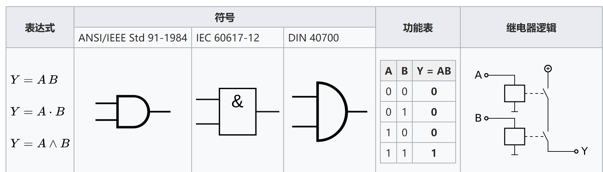
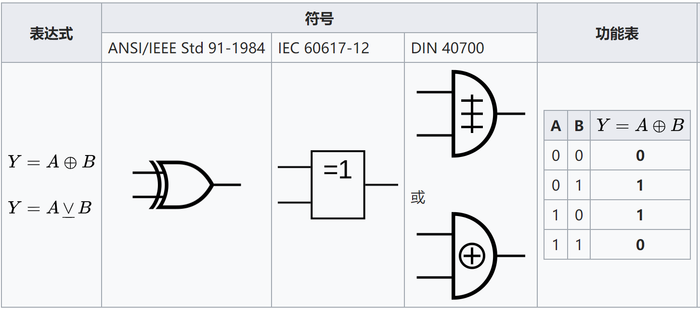
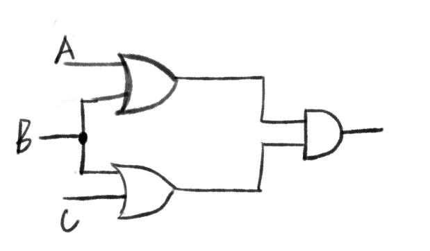
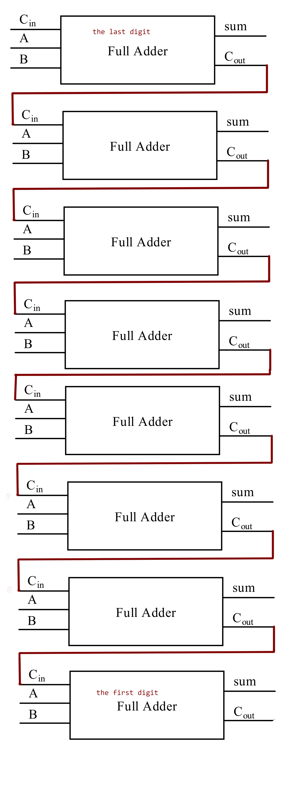
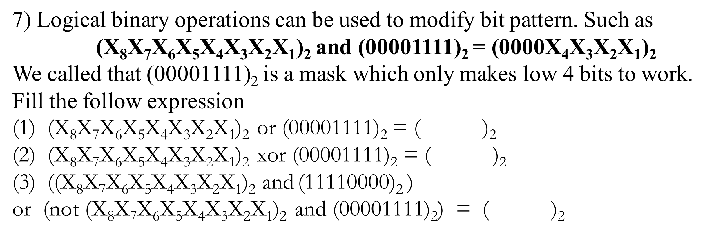

# hw05 for SE
_by ShoringN_

### PART 1&2
three representations: Boolean expression; logic diagram symbol; truth table

1. AND

2. XOR

3. (A+B)(B+C)

4. a truth table

|A|B|X|
|:-|:-|:-|
|0|0|0|
|0|1|0|
|1|0|1|
|1|1|0|

6. 8bit adder circuit

7. `Deserve Reviewing`

(1)X8X7X6X51111

(2)X8X7X6X5X'4X'3X'2X'1

(3)X'8X'7X'6X'5X'4X'3X'2X'1
//'为某位取反，num为下标。
### PART 3
1. 使用维基百科，解释以下概念。

1)Logic gate

In electronics, a logic gate is an idealized or physical device implementing a Boolean function; that is, it performs a logical operation on one or more binary inputs and produces a single binary output.在电子学中，逻辑门是实现布尔函数的理想化或物理设备; 也就是说，它对一个或多个二进制输入执行逻辑运算并产生单个二进制输出。

2)Boolean algebra

In mathematics and mathematical logic, Boolean algebra is the branch of algebra in which the values of the variables are the truth values true and false, usually denoted 1 and 0 respectively.在数学和数学逻辑中，布尔代数是代数的分支，其中变量的值是真值和真值，通常分别表示为1和0。

2. 维基百科：“Flip-flop”，选择中文：

1)Flip-flop 中文翻译是？触发器。

2)How many bits information does a SR latch store? One bit.