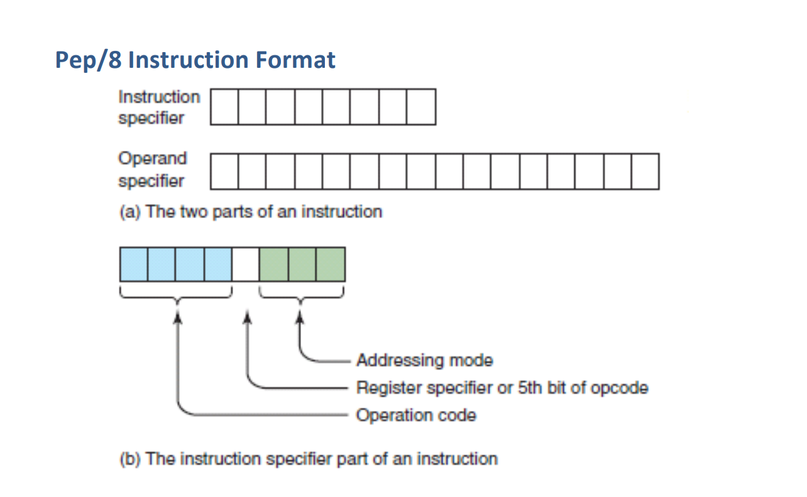
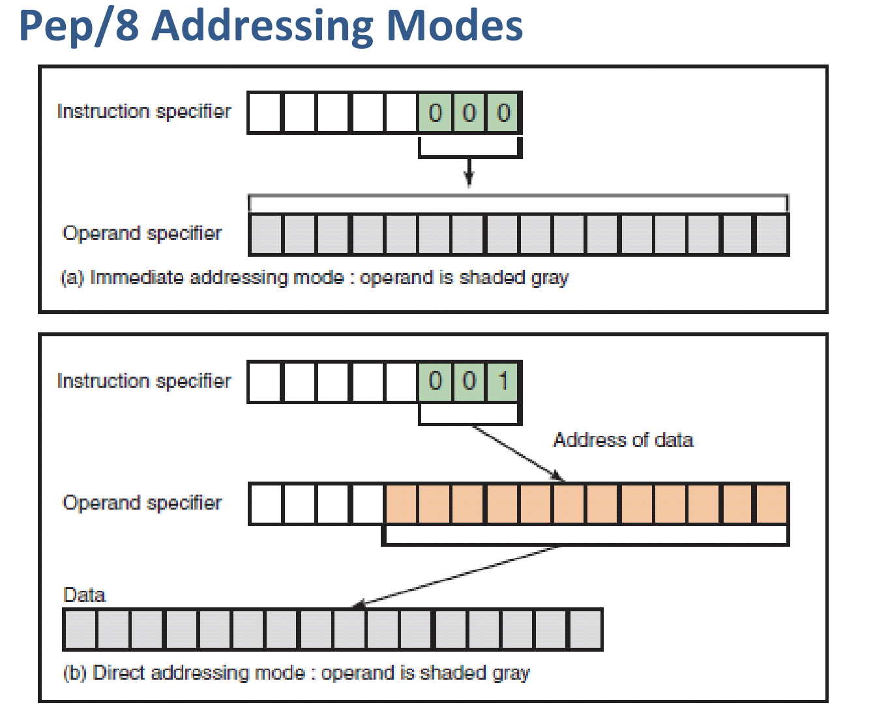

# hw07 for SE
_by ShoringN_

## 1.Program with machine language according to the following c.
int_8 a = 1;
int_8 c = a + 3; 

### 1)Write your assembly code & machine code
|Symbol|Mnemonic|Operand, Mode Specifier|
|:-------------|:------------------|:------|
|         | BR | main  |
| a: | .BLOCK 8   |  |
| c: | .BLOCK 8   |  |
| main| LDA |0x0001,i|
| | ADDA| 0x0003,i|
| | STA| c,d|

### 2）Explain machine code execution with the fetch-decode-execute cycle

1. Fetch the instruction获取指令:The next instruction is fetched from the _memory address_ that is currently stored in the _program counter_ and stored into the _instruction register_;
2. Decode the instruction解码指令:the _instruction register_ is interpreted by the decoder;
3. Read the effective address读取有效地址:
4. Execute the instruction执行指令:The control unit of the _CPU_ passes the decoded information as a sequence of control signals to the relevant function units of the CPU to perform the actions required by the instruction.

### 3）Explain functions about IR, PC, ACC registers in a CPU
> IR-_interrupt register_（中段存储器） - manages requests from I/O devices 管理来自I / O设备的请求
>
> PC-_program counter_（程序计数器） - stores address of the -> next <- instruction in RAM 储存下一个指令的地址
>
>ACC-_accumulator_(累加器) - stores result of calculations 存储计算结果

### 4）Explain physical meaning about vars a & c in a machine
>address

## 2、简答题

### 1）What are stored in memory?
> Data and instructions.
### 2）Can a data or a instruction stored in the same place?
> No.
### 3） Explain Instruction Format with example instructions.
> take the Pep/8 Instruction Format as an example.

the 3-byte-long _instruction format_ consists of two parts, the _instruction specifier_ and _operand specifier_. From leftside to the rightside, the 2-byte-long _instruction specifier_ contains _operation code_ for fist four bits, then followed by one bit for _register specifier_ register specifier, and last three bits for addressing mode.

## 3、解释以下词汇
### 1）汇编语言（_Assembly Language_）
An **assembly (or assembler) language**,often abbreviated asm, is any low-level programming language in which there is a very strong correspondence between the program's statements and the architecture's machine code instructions.
汇编语言是一种低级编程语言，其中程序的语句与架构的机器代码指令之间存在非常强的对应关系。

### 2）编译（_Compiler_）
A **compiler** is computer software that primarily translates computer code from a high-level programming language to machine code to create an executable program.编译器是主要将计算机代码从高级编程语言转换为机器代码以创建可执行程序的计算机软件。

### 3）命令式语言（_Imperative programming_）
In computer science, **imperative programming** is a programming paradigm that uses statements that change a program's state.在计算机科学中，命令式编程是一种编程范式，它使用改变程序状态的语句。

### 4）函数编程语言（_Functional programming_）
In computer science, **functional programming** is a programming paradigm—a style of building the structure and elements of computer programs—that treats computation as the evaluation of mathematical functions and avoids changing-state and mutable data.在计算机科学中，函数式编程是一种编程范式，它作为一种构建计算机程序结构和元素的方式将计算视为数学函数的评估并避免改变状态和可变数据。

### 5）过程式编程（_Procedural programming_）
**Procedural programming** is a programming paradigm, derived from structured programming, based upon the concept of the procedure call.过程式编程是一种编程范式，它源于结构化编程，基于过程调用的概念。
