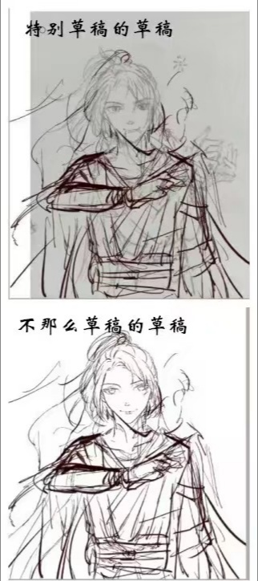
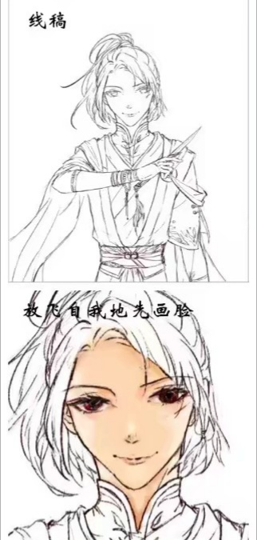
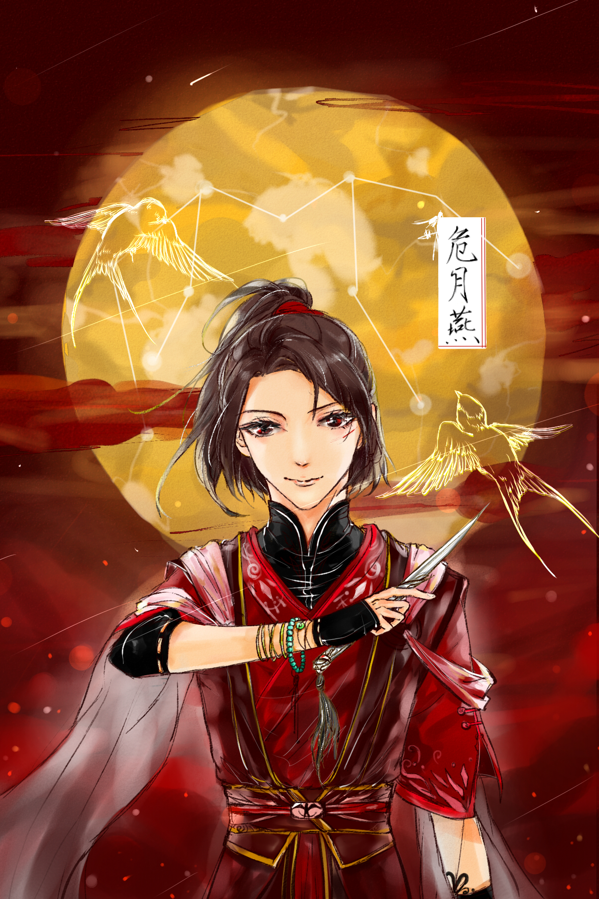

# 【业余记录向】如何使用sai进行板绘
## 一、绘画软件：sai/sai2

1、开发者：SYSTEAMAX

2、下载地址：[sai吧破解版]https://tieba.baidu.com/p/5288915274?lp=5028&mo_device=1&is_jingpost=1&pn=0& 

3、sai的优劣势 ~~对比ps等大佬做图软件而言~~

优势：（1）操作简单，上手容易；（2）支持多图层操作；（3）支持导入笔刷；

劣势：（1）功能很少，仅满足基础绘图需求。

---

## 二、绘画过程

### 1、打草稿
随心所欲信马由缰。大致的构图、人体构想要在这步完成，用粗糙的~~只有自己看得懂~~线条勾勒边缘，不必刻画细节。

### 2、勾线
运用“笔”对照草稿勾线，确保线条平滑无分叉。个人习惯把笔刷的最小浓度值调得较*小*，有助于增强线条笔压质感。

### 3、铺色
根据光源确定大致的色块，区分高光和阴影。（对于本毫无色感可言的业余爱好者而言铺色一切看心情）善用**魔术棒、选区笔和选区擦**辅助上色。

### 4、细化上色
可以先擦边界，选定**锁定透明图层**按键，可有效防止涂色出界。或者放任画笔出界，混完色再统一擦去多余部分。

总体过程：一层层由浅入深上阴影颜色——一层层刷高光——放大进行细节（如发丝、眼睛、饰物等）绘制——改线稿颜色

P.S. 平涂强调阴影边缘质感，厚涂柔化颜色的平滑过度。

### 5、整体评估，增强效果
预览整体画面，对不协调的色块进行调整。运用**高光图层**等工具添加高光等效果。

## 成图预览

---
P.S. SAI完全可以完成最基本的绘图需求。B站上亦有很多大佬的绘图录屏可以参考，值得热爱板绘的朋友上手。

感谢阅读。——SHN