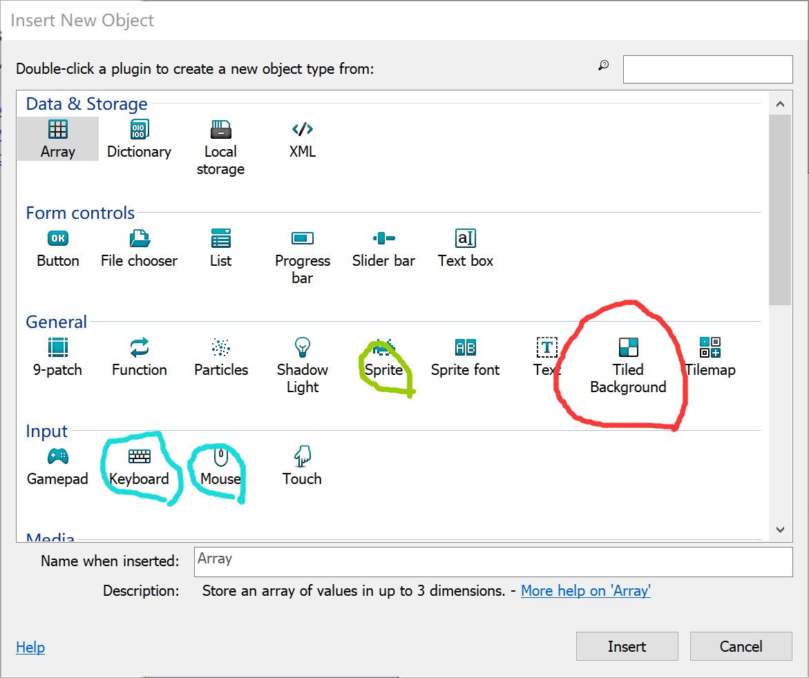
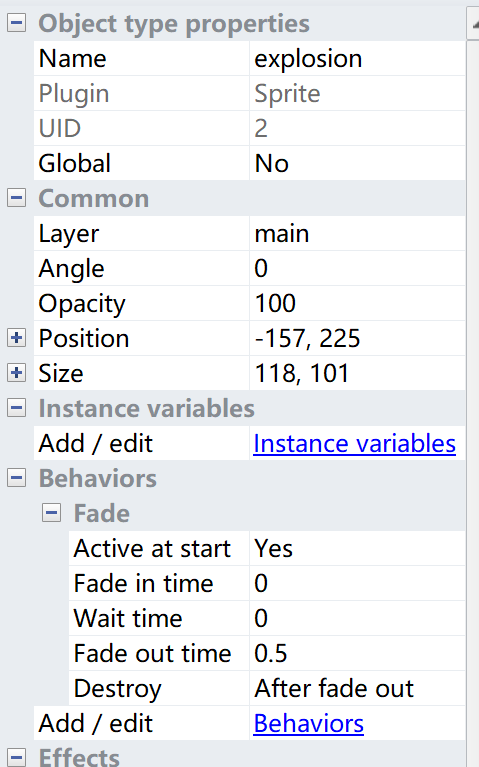
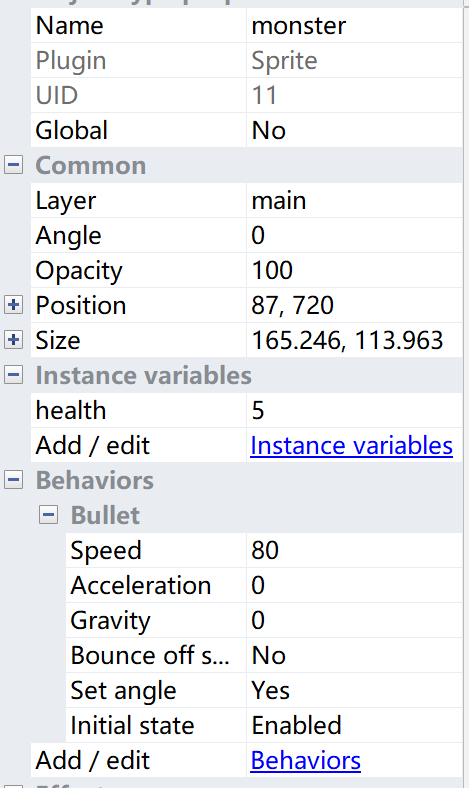
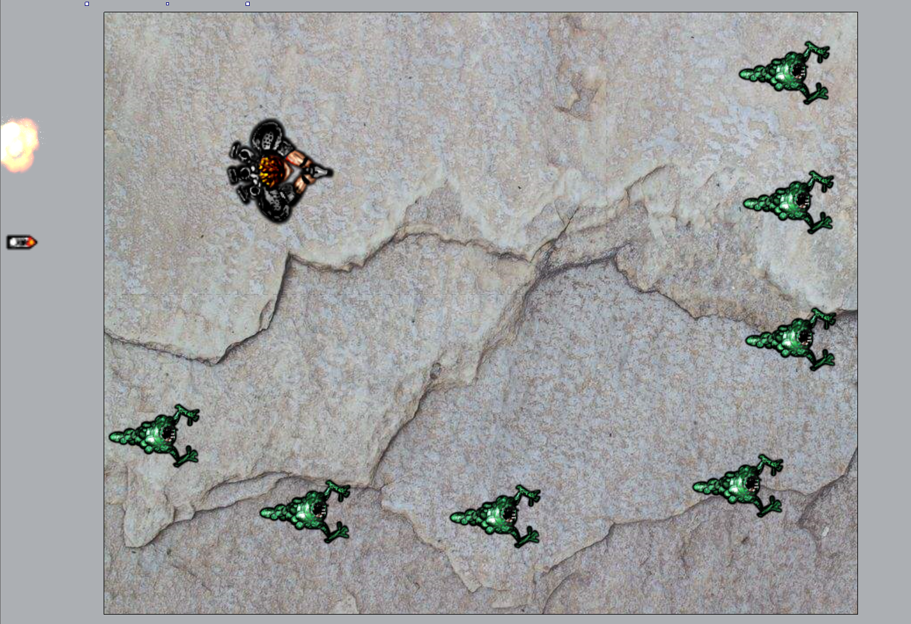

# 使用construct2制作biubiu打怪兽小游戏
_by ShoringN_

**此博客为主要操作指引，供制作者对照快速上手；同时附有部分笔者在游戏制作中遇到的问题与感悟的快捷方法记录，供同好参考交流，避免如笔者一般绕远路；若需查看详细指引及步骤解释请点击`新手入门游戏指引（官网）`超链接。**

## 一、工具Constuct2

* Construct 2：[官网地址](https://www.scirra.com/construct2)

* [官网下载地址（免费版即可）](https://www.scirra.com/manual/2/installing)

* [新手入门游戏指引（官网）](https://www.scirra.com/tutorials/37/beginners-guide-to-construct-2)

## 二、新手入门游戏（biubiu小怪兽）步骤指引
### (一)导入对象Inserting objects

1. 双击进入“inserting objects”界面。点击"titled background"插入桌布图片；更改图层1名字为“background”，锁定该图层（防止背景被更改，便于后续操作）。
2. 新建图层2，点击"sprite"(小精灵)插入其余四个对象(player, bullet, explosion, monster)；并更改该图层名字为“main”。
3. 双击进入“inserting objects”界面。点击"keyboard"和"mouse"。_`【卡顿1】务必记得该步骤（笔者因遗漏后续一度卡壳）`_

* `TIPS1`：**时刻注意所在的图层（active layer），切忌串图层**
* `TIPS2`：**这一步先不要急着复制monsters**

### (二)加入动作 Adding behaviors
1. 选定对象，在左侧Properties栏中更改与对象匹配的名字；
2. 点击Add / Edit Behaviors，对每个对象分别添加动作；

* **player** (1)8 Direction movement. (2)Scroll to. (3)Bound to layout.

* **bullet** (1)Bullet movement. (2)Destroy outside layout.

* **monster** (1)Bullet movement.

* **Explosion** (1)Fade.
3. 在Properties栏修改部分动作属性（speed of player and bullet），最终四个对象面板如下图；
4. 复制monsters，布局如下图。
* `TIPS3`：**快速复制对象的方法：Ctrl+鼠标拖动**

### (二)加入事件 Adding events
1. 在主页面双击进入“inserting objects”界面，加入"text"文本框。
2. 打开界面上方的event sheet界面，选择对象一个个添加events（事件-触发条件）和actions（动作），最终完成参考以下截图。

>内容包括（1）使player随着鼠标转向；受键盘控制移动；鼠标点击时player射击bullet。
（2）每三秒产生新的monster；离开界面的monster随机运动；monster与bullet撞击时monster消失，出现explosion。
（3）设置变量；消灭一个monster记一分；将分数显示于文本框中。
（4）player与monster撞击后player消失。
* `TIPS4`**如果不慎关掉了event sheet界面，可以在主页面右键edit event sheet打开(千万不要像笔者傻乎乎重启结果原先又没保存成功导致“只不过是重头再来”)**
* `TIPS5`**善用`搜索框`寻找需要的事件**

_到这里biubiubiu小游戏就做得差不多啦，我们可以把monster改成自己损友的写真享受欺负的快乐。(微笑)_

### (三)runrunrun biubiubiu

---
P.S. 几年前风靡一时地微信打飞机小游戏其实本质很类似。这样看来，是不是做小游戏也不复杂，还挺有意思的呢？construct 2非常容易上手，且可以实现很多新创意新想法（官网和贴吧上都有很多大佬分享）。希望大家都可以尝试一下。

感谢阅读。——SHN
