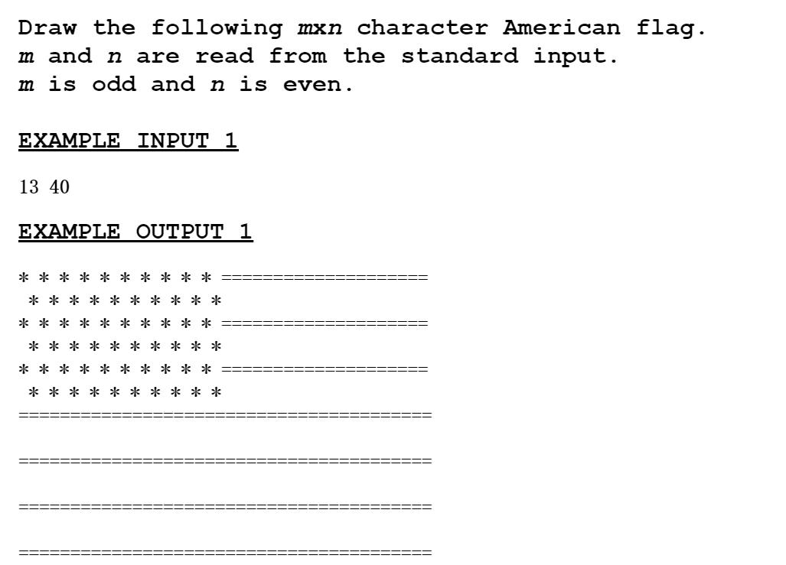
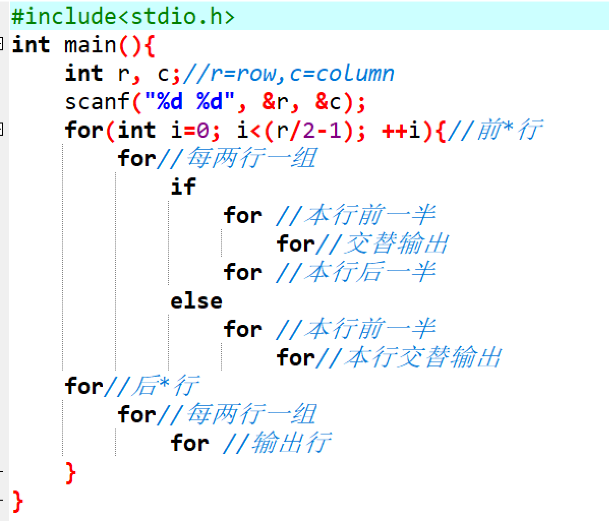
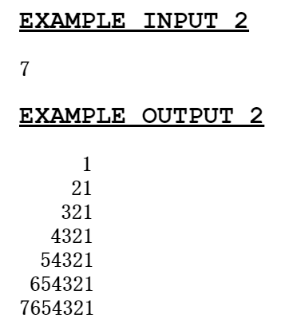
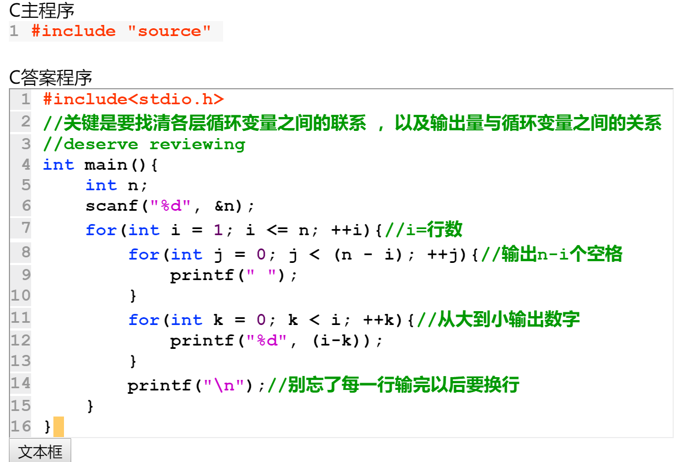
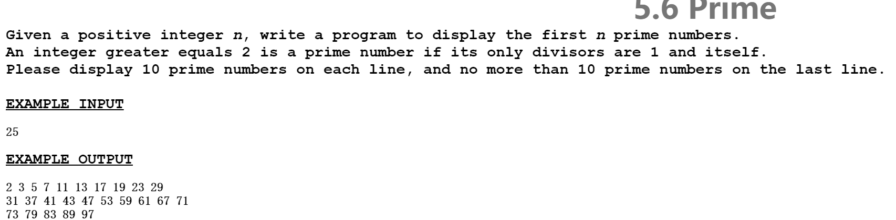
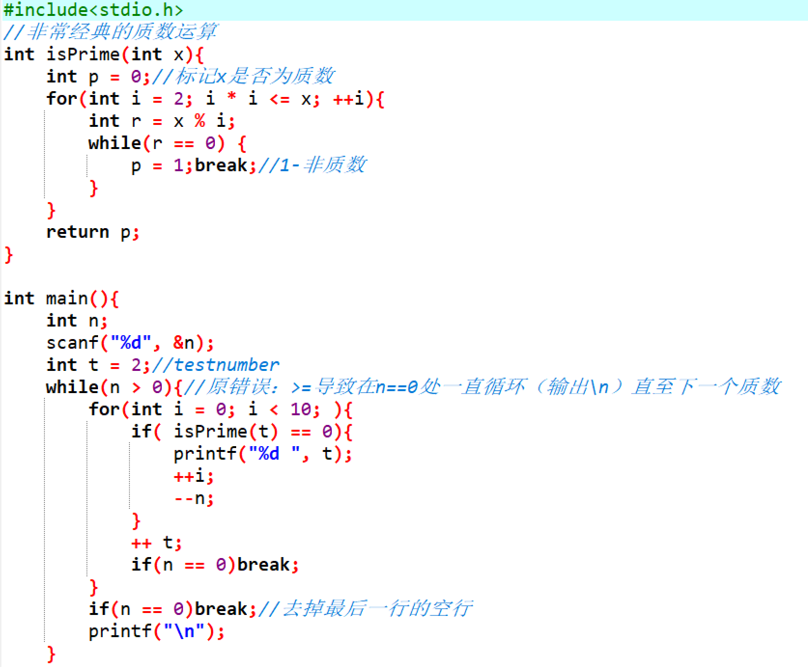

# 关于C语言多层循环结构的一些经验01
## 副标题：新手码农的少许体会记录01
_by ShoringN_

---

_前言：_

笔者已经上了一个月的程序设计课了。我从一开始的“hello, world!”都不会写，到现在还能完成用一些基础的循环结构输出数组或图案，个人还是觉得突破还是可观的。路漫漫其修远兮，吾将上下而求索。作为CS学生，笔者如今万里长征才迈出了第一步，前途道路依旧坎坷而遥远。

在本篇技术博客，笔者主要讲一下对于`多层循环结构`的一些理解。

### （一）多层循环可以达成的目的包括但远远不限于：
1. 单行最多输出n个数字;
2. 输出符号/数字组合为特定的图案；
3. 求最大公约数/最小公倍数；
4. 求前n个质数；
5. ……

### （二）体会
我个人觉得写循环结构最需要注意的两点是
1. `整一套程序的逻辑结构（包括嵌套的for关系以及if分支）`
2. `每一层循环变量和输出量之间的函数关系`

关于1.逻辑结构，我倾向于在详细填充之前先打个草稿，把大致逻辑结构固定下来。（否则for一多整个大脑CPU都要爆炸了）同时要非常善于用**缩进**来突出层次。
下面这个例题就是一个草稿案例：

关于2.变量关系，因为循环里每一层都会有独立的循环变量（如i、j），况且互不影响，所以把每一层变量和输出量用函数式联系起来又是一个重点。这里变量关系一旦处理不好就很容易少/多循环或者达不成想要的效果。案例如：

### （三）改进方式

其实在一个循环里嵌入太多循环容易乱，到最后自己也想不起来要做什么。这时候有一个解决方案，就是把中间的几个循环拎出来，在main函数之前就先作为新函数定义。

这里不得不提的一个例子就是把我掏空的“输出前n个质数”的题目。感谢大佬的指点，我终于把自己从四层循环的泥沼里救了出来。提前定义isPrime函数可以使主函数更加清晰而且思维不容易乱。_(利用参量1/0表示是否质数这波操作实在太妙了)_

### 还有一些新手编程时的血的教训

1. for( ; ; )中间的;一度打成,还认为自己很对……
2. 时刻注意输入法是中文还是英文，符号错了就很难受；

---
P.S. 我比较喜欢直接在代码上做注释（包括这步操作实现的功能/自己的思维缺陷etc.）提醒自己，个人觉得这种标识在入门阶段对理清逻辑与警示错误很有益处。

感谢阅读。——SHN