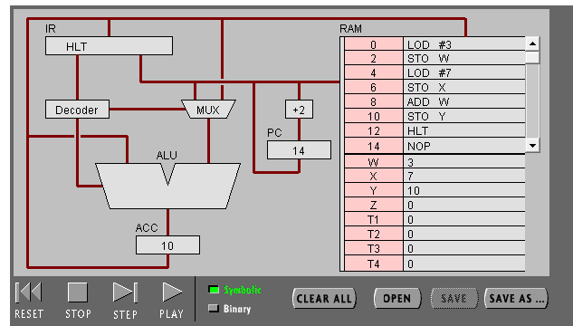
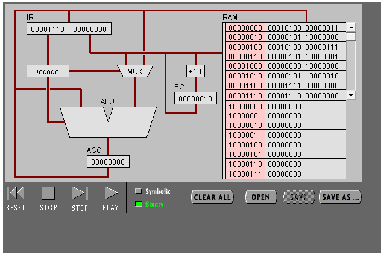

# 硬件编程–机器指令编程实验报告
## 聂硕琳 18342078
---
### 目录
- 一、实验目标
- 二、实验步骤与结果
  - 任务一：简单程序
  - 任务二：简单循环
- 三、实验小结
---

### 一、实验目标
>理解冯·诺伊曼计算机的结构
>
>理解机器指令的构成
>
>理解机器指令执行周期
>
>用汇编编写简单程序

### 二、实验步骤与结果
#### 任务一：简单程序

**（1）打开网页 The PIPPIN User’s Guide ，然后输入 Program 1：Add 2 number**

**（2）点step after step。观察并回答下面问题：**
1. PC，IR 寄存器的作用

> 在中央处理器的控制部件中，包含的寄存器有指令寄存器(IR)和程序计数器(PC).
>
>`指令寄存器`（IR，_Instruction Register_），是临时放置从内存里面取得的程序指令的寄存器，用于存放当前从主存储器读出的正在执行的一条指令。
>
>`程序计数器`(PC, _Program Counter_)是用于存放下一条指令所在单元的地址的地方。

2. ACC 寄存器的全称与作用。

>**ACC**：(_Accumulator_）是`累加器A`缩写。累加器A是一个具有特殊用途的二进制8位寄存器，专门用来存放操作数或运算结果。在CPU执行某种运算前，两个操作数中的一个通常应放在累加器A中，运算完成后累加器A中便可得到运算结果。

3. 用“LOD #3”指令的执行过程，解释Fetch-Execute周期。
> - PC拿取第一个地址，从RAM中获得第一条指令(_LOD #3_)；
> - 指令存入IR；
> - 指令通过decoder（_指令译码器（Instruction Decoder，ID）_），将指令传入MUX（_数据选择器(multiplexer)_）和ALU；
> - IR将数据通过MUX传入ALU，寄存在ACC中；
> - PC读取下一条指令的地址；

4. 用“ADD W” 指令的执行过程，解释Fetch-Execute周期。
> - PC拿取地址，从RAM中获得指令(_ADD W_)；
> - 指令存入IR；
> - 指令通过decoder（_指令译码器（Instruction Decoder，ID）_），将指令传入MUX（_数据选择器(multiplexer)_）和ALU；
> - ACC将数据7传回给ALU；
> - IR中的W地址在RAM中将W中的数据7取出，通过MUX传入ALU；
> - ALU完成3与7求和，将结果10存入ACC；
> - PC读取下一条指令的地址；



5. “LOD #3” 与 “ADD W” 指令的执行在Fetch-Execute周期级别，有什么不同。
> “ADD W”需要从RAM中调出数据，且ACC要实现加法运算，所需步骤更多。

**（3）点击“Binary”,观察回答下面问题**

1. 写出指令 “LOD #7” 的二进制形式，按指令结构，解释每部分的含义。
> 00010100 00000111
> 
> 指令结构中前8位为操作说明符（_instruction specifier_），后16位为指令说明符（_operand specifier_）。
>
> **00010100**-instruction: load the operand into the A register;
>
> **00000111**-the operand number "7";

2. 解释 RAM 的地址。
> 通常存储器以字为单位进行数据的读写操作，每次读出或写入一个字，将存放同一个字的存储单元编成一组，并赋予一个号码，称为地址。不同的字存储单元被赋予不同的地址码，从而可以对不同的字存储单元按地址进行访问。字(存储)单元也称为地址单元。


3. 该机器CPU是几位的？（按累加器的位数）
> 8 bits.

4. 写出该程序对应的 C语言表达。
```
int W = 3;
int X = 7;
int Y = W + X;
```

#### 任务二：简单循环
**1） 输入程序Program 2，运行并回答问题：**

1. 用一句话总结程序的功能
> 利用循环对0不断进行-1操作；

2. 写出对应的 c 语言程序
```
int X = 0;
X-=1;
while(x != 0){
    X-=1;
}
```
**（2） 修改该程序，用机器语言实现 10+9+8+..1 ，输出结果存放于内存 Y**

1. 写出 c 语言的计算过程
```
int X = 10;
int Y = 0;
while(X != 0){
    Y = Y + X;
    X -= 1;
}
```

2. 写出机器语言的计算过程
```
0 LOD #10
2 STO X
4 JMZ 18
6 LOD Y
8 ADD X
10 STO Y
12 LOD X
14 SUB #1
16 JMP 4
18 HLT 
```
3. 用自己的语言，简单总结高级语言与机器语言的区别与联系。
> 区别
- 高级语言：更加接近自然语言，可较方便完成复杂的运算；不能直接由机器读取；
- 机器语言：只由0和1构成，对于编程者而言较难对应；可以直接由机器读取；
> 联系
- 高级语言由编译器翻译为机器语言后被机器读取，执行指令.
