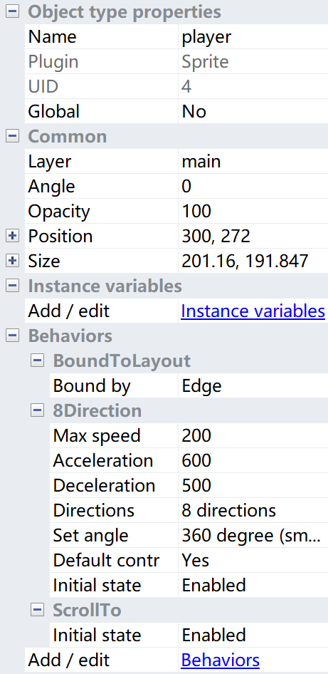
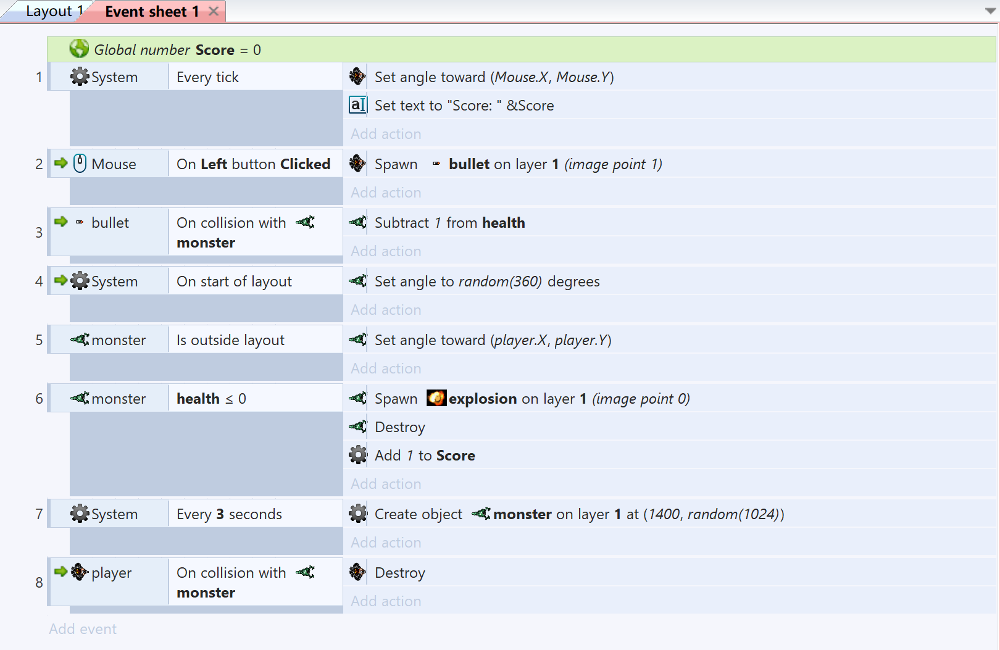

# HTML5游戏设计与制作(进阶篇)
_by ShoringN_
---
### 目录
- 一、实验目标
- 二、实验工具
- 三、实验步骤与结果
---

### 一、实验目的
1. 了解软件开发的基本过程
2. 学习一些面向对象的编程思想
3. 开发一个简单游戏

### 二、实验工具
Construct 2：https://www.scirra.com/construct2

### 三、实验步骤与结果
#### 1、游戏策划
```
· 楔子(Setting)：末世降临，变异怪兽肆虐，人类所剩无几。仅存的战士为了保存人类最后的一线生机，端起了武器向怪兽射击，殊死搏斗。生死一念之间……
· 玩法(Gameplay)：玩家射杀侵袭的一批怪兽任务完成。玩家怪兽杀死，任务失败。玩家使用鼠标避让并向自己袭来的怪兽，并发射子弹杀死怪兽……
· 人设与道具（Game Sprites）：
Player：手握新型武器，可以360旋转，连续无限量向前发射子弹，怪兽中弹五发即死亡。
Boss: 绿色蝎型变异怪兽。
… 
```
#### 2、面向对象的分析设计方法
_将游戏的事物（Things）映射到游戏对象（Objects），然后根据策划中对象的描述，定义这些对象的属性，如图片、位置、尺寸等，再描述对象与系统设备、其他对象交互的行为。最后，用游戏系统框架提供的层（Layer）将这些对象组织起来，形成背景、游戏内容等层次。_

e.g.object——player


#### 3、编程
_使用可视化工具，我们定义的游戏中的对象（数据及其表示）。编程的任务就是特定条件下，用系统提供的操作序列去改变这些对象的属性（数据）。_

运用 **CRC（Class-Responsibility-Collaboration）卡片方法** 描述游戏中的所有对象与事件。
| object       | event          | actions |
|:-------------|:------------------|:------|
|system| every tick| player turn towards mouse|
|system| every 3s| create new monster|
|mouse| every left clicked| player shoot bullet|
|bullet| collide with monster| destroy|
|player| collide with monster| destroy& GG|
|monster| collide with bullet five times| destroy|
|monster| move outside the layer| turn back|


#### 4、最终成果图
