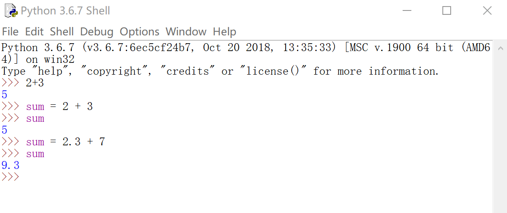
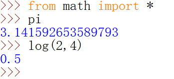
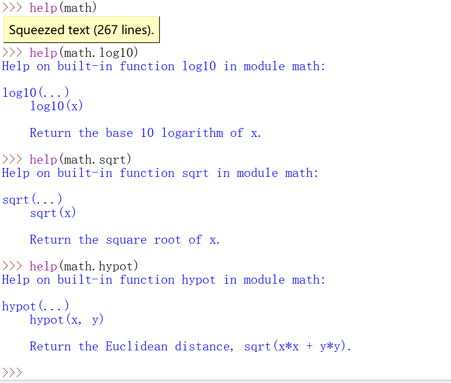
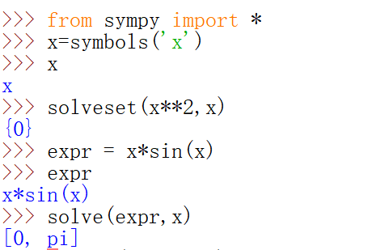

# 硬件编程–机器指令编程实验报告
##  18342078
---
### 目录
- 一、实验目标
- 二、实验环境
- 三、实验步骤与结果
---

### 一、实验目的
1. 了解一种“解释型”语言 python
2. 使用 python 做一些简单的科学计算

### 二、实验环境
- 编程工具：Python（winpython / Anaconda）
- 操作系统：Windows (only)
注:建议使用 Anaconda 
- _C:\Users\shoring\Downloads\WPy-3670\IDLE (Python GUI)_//已进入交互页面，不用输入_python_

### 三、实验步骤与结果
1. 使用简单表达式

2. 使用数学函数

3. 使用Python做高数题目
**使用SymPy 的符号库**
- 求一元一次方程；

- 求导数；

**线性代数工具**
- 求矩阵大小，求矩阵转置，求矩阵的逆。

