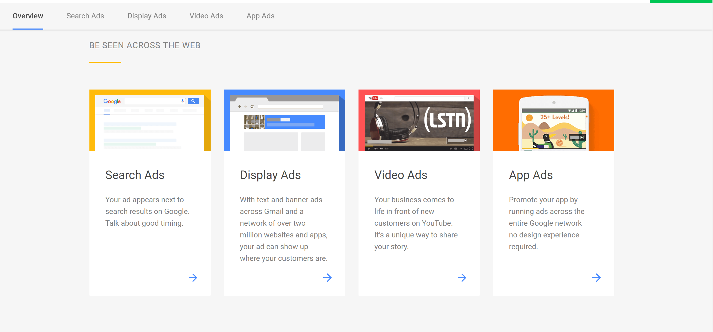
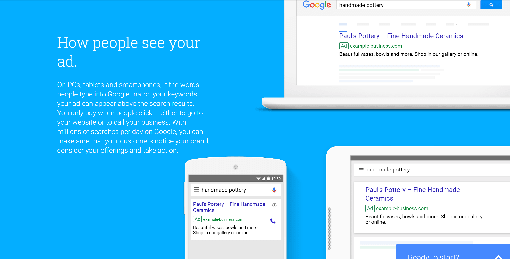

# IT伦理与道德
## 搜索引擎`竞价排名`引发的伦理问题
_by ShoringN_
---
_前言：关键字广告竞价拍卖的盈利模式并非近年兴起的产业。早在20世纪90年代Overtune(原来的Gogo．corn)已为这项服务申请了专利。而2016年骇人听闻的`魏则西事件`则重新引爆了大众对搜索引擎竞价排名的热议与质疑。_

### 一、竞价排名简介
#### 1、什么是竞价排名？
`竞价排名`（_Bidding Rank_）是一种**按效果付费**的网络推广方式。其具体做法是，广告主在购买该项服务后，通过注册一定数量的关键词，按照**付费最高者排名靠前**的原则，购买了同一关键词的网站按不同的顺序进行排名，出现在网民相应的**搜索结果**中。

#### 2、竞价排名的背景
>* **需求催生市场**：
>
>自从Oveture最先创造并应用了关键字广告竞价拍卖的盈利模式之后，对**搜索引擎（广告发布者）**来说，_竞价排名_ 彻底解决了只有用户而没有**客户**的问题；对于**企业（广告主）** 来说，搜索引擎提供了互联网时代下一种绝佳的宣传模式。
>
>搜索引擎实现了对客户的自然分流，使客户和企业之间形成一种**互动**，摆脱了传统电视、报纸广告的一对多的形式，更加有**针对性**的向有需要的客户推广自己的产品。
>
> * **部分地区规模庞大**：
>
>2005年5月，信息产业部下属评测机构赛迪评测发布的《中国网络营销服务市场状况调研报告》指出，目前在国内发达地区，已有**80．97％**的企业使用过网络营销服务，有50．14％企业已经购买或打算购买百度竞价排名服务。然而就是这种经济有效的营销模式却在今年的三鹿奶粉事件中被牵扯出来，百度被卷入巨大的**道德漩涡**之中，竞价排名制度的商业模式也开始受到**质疑**。

#### 3、竞价排名的缺点
1. 竞价排名会相当昂贵
2. 竟价排名只能是暂时性的措施。
3. 竞价排名会遭遇竞争对手的恶意点击，来消耗你的广告经费。
4. ……

**** 
### 二、竞价排名带来的伦理争议
#### 1、魏则西事件
魏则西事件是2016年4月至5月间发生在中国的一起牵涉**医疗诈欺广告及网络搜寻服务公司未尽企业社会责任**的社会事件。受害者魏则西及其家人因在**百度**推荐的武警北京市总队第二医院接受了未经审批且效果未经确认的治疗方法，导致耽误治疗，最终于2016年4月12日不治去世。事件随后在五一假期开始升温，导致百度股票暴跌。包括官方媒体在内的中国舆论对此也进行了批判，除了百度公司列为相关嫌犯而被整肃之外，事件延烧到医院将旗下科室外包给莆田系一事也被披露，武警二院在此事件中即遭到摘牌并起诉有关负责人。


```
我不想死，我21年的奋斗和努力还没有化为光和热，
我还有梦想，我想看看这个广大的世界，
我想经历自己的一个完整的人生，成就自己的事业。
同时我是独子，我无法想像如果我现在死去，
我的父母将会怎样度过他们的晚年。
                      ——魏则西生前求助视频
```
****

### 三、 根据《广告法》分析事件
#### 1、竞价排名的性质
* **竞价排名是一种商业广告**
> 据`《中华人民共和国广告法》`第二条第二款：本法所称广告，是指商品经营者或者服务提供者**承担费用**，通过一定**媒介和形式**直接或者间接地**介绍自己所推销的商品**或者所提供的服务的商业广告。竞价排名即搜索引擎商通过用户付费的高低为标准，决定客户对同一关键词的在其搜索网站上的优先排列序列。
>
> 其符合商业广告的一般特点
> 1. 以营利为目的
> 2. 传播商业信息
> 3. 需要支付广告费用
> 4. 通过一定的媒介和形式

#### 2、竞价排名的责任与义务
《中华人民共和国广告法》规定：
>* 第三条 广告应当`真实`、合法，以健康的表现形式表达广告内容
>
>* 第四条 广告不得含有虚假或者引人误解的内容`，不得欺骗、误导`消费者。广告主应当对广告内容的`真实性负责`。
>
> * 第四十四条 利用`互联网`从事广告活动，适用本法的各项规定。
>
>* 第十四条 通过大众传播媒介发布的广告应当`显著标明“广告”`，与其他非广告信息相区别，不得使消费者产生误解。
>
>* 第十六条` 医疗、`药品、医疗器械广告`不得`含有下列内容：
>
>　　（一）表示功效、安全性的`断言或者保证`；
>
>　　（二）说明治愈率或者`有效率`；
>
>　　（三）与其他药品、医疗器械的功效和安全性或者其他医疗机构`比较`；
>
>　　（四）利用广告代言人作推荐、证明；
>
>　　（五）法律、行政法规规定禁止的其他内容。
>
>　　第三十四条 广告经营者、`广告发布者`依据法律、行政法规查验有关证明文件，`核对广告内容`。对`内容不符`或者证明文件不全的广告，广告经营者不得提供设计、制作、代理服务，广告发布者`不得发布`。

对照法律条文分析百度的竞价排名模式，其在广告真实性的监督与显著标识上的处理失责明显，暴露出其管控机制的缺陷。

--- 

### 四、寻求搜索引擎竞价排名更佳解决方案
_百度与Google，前者是全球最大的搜索引擎，后者全球最大的中文搜索引擎，两者的核心业务都是搜索，但运营的模式和效果却有所差异。_
#### 对比Google
_Google Adsense_ 分为搜索广告(_search ads_) 和陈列广告(_search ads)。以下是 _Google ads_ 官网的截图。



* Google Adsense和百度竞价排名采取的方式不同。_search ads_ 虽然出现在搜索界面上，但陈列在界面右栏，并不处于搜索结果之中，且拥有显著标识，可有效防止用户混淆。而_search ads_ 通过`关联合作网站`相关内容进行广告投放。举个例子：比如用户在看一个网站上的一篇关于DIY电脑的文章，那么其Google Adsense广告栏处就可能出现的是DIY电脑卖场的广告或者是电脑配件广告。
* 百度将广告和`搜索结果放在一起`，而且将广告商的网页置于搜索结果的前几位，这就造成用户`无法判断`搜索结果和广告，从而在无意中点击了广告，给百度制造了利润。
---
P.S. 通过以上的分析，我们可以明显看到百度的竞价排名模式存在极大的缺陷。如今百度已经得到了判决与惩治，希望魏则西的惨案不会再次发生。

感谢阅读。——SHN