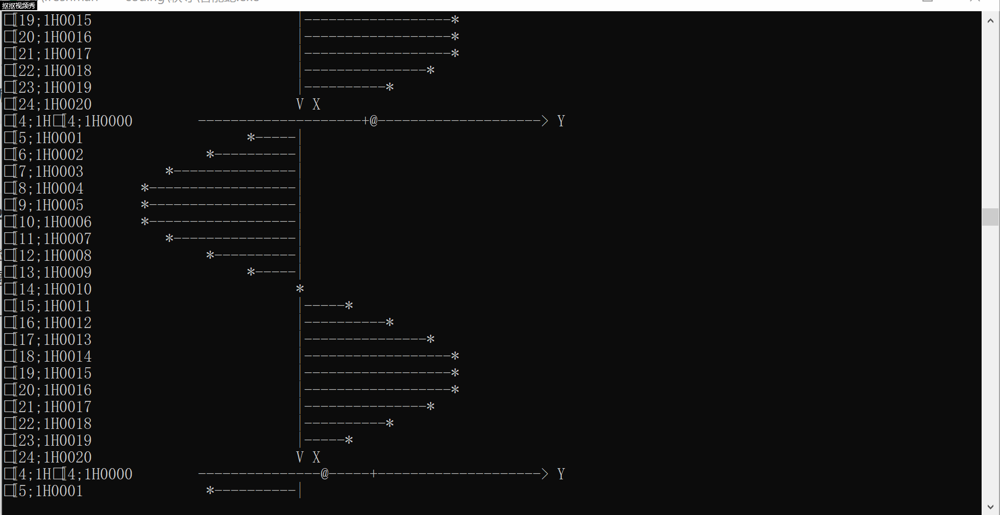

# 智能蛇实验报告
##  18342078
---
### 目录
- 一、实验目标
- 二、实验环境
- 三、实验步骤与结果
---
### 一、实验目的
1. 了解 **算法** 与 **智能** 的关系
2. 通过算法赋予蛇智能
3. 了解 Linux IO 设计的控制
### 二、实验过程记录
#### 1、VT 100 终端标准

```
·     1. VT100 控制码归类如下。
       \033[0m              取消之前所有属性
       \033[1m              设置高亮度
       \033[4m              下划线
       \033[5m              闪烁
       \033[7m              反显
       \033[8m              消隐
       \033[30m -- \033[37m 设置前景色 |------------+
       \033[40m -- \033[47m 设置背景色 |------------+
       \033[nA              光标上移 n 行           |
       \033[nB              光标下移 n 行           |
       \033[nC              光标右移 n 行           |
       \033[nD              光标左移 n 行           |
       \033[y;xH            设置光标位置            |
       \033[2J              清屏                    |
       \033[K               清除从光标到行尾的内容  |
       \033[s               保存光标位置            |
       \033[u               恢复光标位置            |
       \033[?25l            隐藏光标                |
       \033[?25h            显示光标                |
                                                    V
             +------<----------------------------<--+
             |
             V
    2. VT100 的颜色输出分为,前景色和背景色可以分别输出,如果不需要之前所有的设置可以用\033[0m取消。
        1. 字背景颜色范围:40----49
            40:黑
            41:深红
            42:绿
            43:黄色
            44:蓝色
            45:紫色
            46:深绿
            47:白色
         2. 字前景颜色范围:30----39
            30:黑
            31:红
            32:绿
            33:黄
            34:蓝色
            35:紫色
            36:深绿
            37:白色
    3. 输出一个字符串( something here )有前景色和背景色代码如下:
          printf("\033[41;36m something here \033[0m");
```
`sin函数动态图像`
 
#### 2、实现 kbhit()
> 插入原snake代码
```
#include <stdio.h>
#include <string.h>
#include <sys/time.h>
#include <sys/types.h>
#include <unistd.h>
#include <termios.h>
#include <unistd.h>

#define SNAKE_MAX_LENGTH 20
#define SNAKE_HEAD 'H'
#define SNAKE_BODY 'X'
#define BLANK_CELL ' '
#define SNAKE_FOOD '$'
#define WALL_CELL '*'

char map[13][13]=
{"************",//初始状态 
 "*XXXXH     *",//直接打表 
 "*          *",
 "*          *",
 "*          *",
 "*          *",
 "*          *",
 "*          *",
 "*          *",
 "*          *",
 "*          *",
 "************",
};

//define vars for snake, notice name of vars in C
//int snakeX[SNAKE_MAX_LENGTH] = {1,2,3,4,5};
//int snakeY[SNAKE_MAX_LENGTH] = {1,1,1,1,1};
int snakeLength = 5;
int snake_xy[SNAKE_MAX_LENGTH][2];//x横坐标，y纵坐标
int end = 0;

void output(){
	system("cls");//win清理控制台 
	for(int i = 0; i < 12; ++i){
		printf("%s\n", &map[i]);
	}
}

//snake stepping: dy = -1(up),1(down); dx = -1(left),1(right), 0 (no move)
void moveButHead(int snakeLength){
	map[snake_xy[snakeLength-1][0]][snake_xy[snakeLength-1][1]] = ' ';//蛇尾变为' ' 
	for(int i = snakeLength-1; i > 0; --i){//后一节替代前一节的位置
		snake_xy[i][1] = snake_xy[i-1][1];//倒叙赋值，从尾部开始拷贝，防止覆盖原数据 
		snake_xy[i][0] = snake_xy[i-1][0];
	}
}

void endGame(){
	system("cls");
	printf("GAME OVER");
}

void snakeMove(int snakeLength){
	char instructer = getchar();
	switch(instructer){
		case 'a': case 'A':{ 
			if(snake_xy[0][0] != snake_xy[1][0]){//蛇头和第二节不在同一行 
				moveButHead(snakeLength); 
				map[snake_xy[0][0]][snake_xy[0][1]] = 'X';//原蛇头变为蛇身 
			    map[snake_xy[0][0]][snake_xy[0][1]-1] = 'H';//蛇头向左转
		    	snake_xy[0][1]--;//蛇头纵坐标-1 
			} 
		} break;
		case 'd': case 'D':{ 
			if(snake_xy[0][0] != snake_xy[1][0]){//蛇头和第二节不在同一行 
				moveButHead(snakeLength); 
				map[snake_xy[0][0]][snake_xy[0][1]] = 'X';//原蛇头变为蛇身 
			    map[snake_xy[0][0]][snake_xy[0][1]+1] = 'H';//蛇头向右转
		    	snake_xy[0][1]++;//蛇头纵坐标+1 
			} 
		} break;
		case 'w': case 'W':{ 
			if(snake_xy[0][1] != snake_xy[1][1]){//蛇头和第二节不在同一列 
				moveButHead(snakeLength); 
				map[snake_xy[0][0]][snake_xy[0][1]] = 'X';//原蛇头变为蛇身 
			    map[snake_xy[0][0]-1][snake_xy[0][1]] = 'H';//蛇头向上转
		    	snake_xy[0][0]--;//蛇头横坐标-1 
			} 
		} break;
		case 's': case 'S':{ 
			if(snake_xy[0][1] != snake_xy[1][1]){//蛇头和第二节不在同一列 
				moveButHead(snakeLength); 
				map[snake_xy[0][0]][snake_xy[0][1]] = 'X';//原蛇头变为蛇身 
			    map[snake_xy[0][0]+1][snake_xy[0][1]] = 'H';//蛇头向下转
		    	snake_xy[0][0]++;//蛇头横坐标+1 
			} 
		} break;
		case 'q': case 'Q':{
			end = 1;
			endGame();
		}break;
	}
}
static struct termios ori_attr, cur_attr;

static __inline 
int tty_reset(void)
{
        if (tcsetattr(STDIN_FILENO, TCSANOW, &ori_attr) != 0)
                return -1;

        return 0;
}


static __inline
int tty_set(void)
{
        
        if ( tcgetattr(STDIN_FILENO, &ori_attr) )
                return -1;
        
        memcpy(&cur_attr, &ori_attr, sizeof(cur_attr) );
        cur_attr.c_lflag &= ~ICANON;
//        cur_attr.c_lflag |= ECHO;
        cur_attr.c_lflag &= ~ECHO;
        cur_attr.c_cc[VMIN] = 1;
        cur_attr.c_cc[VTIME] = 0;

        if (tcsetattr(STDIN_FILENO, TCSANOW, &cur_attr) != 0)
                return -1;

        return 0;
}

static __inline
int kbhit(void) 
{
                   
        fd_set rfds;
        struct timeval tv;
        int retval;

        /* Watch stdin (fd 0) to see when it has input. */
        FD_ZERO(&rfds);
        FD_SET(0, &rfds);
        /* Wait up to five seconds. */
        tv.tv_sec  = 0;
        tv.tv_usec = 0;

        retval = select(1, &rfds, NULL, NULL, &tv);
        /* Don't rely on the value of tv now! */

        if (retval == -1) {
                perror("select()");
                return 0;
        } else if (retval)
                return 1;
        /* FD_ISSET(0, &rfds) will be true. */
        else
                return 0;
        return 0;
}

//将你的 snake 代码放在这里

int main()
{
    //设置终端进入非缓冲状态
    int tty_set_flag;
    tty_set_flag = tty_set();

  	//初始化位置作标 
	for(int i = 0; i < snakeLength; ++i){
		snake_xy[i][0] = 1;//初始位置在第二行
		snake_xy[i][1] = snakeLength - i; 
	}
	while(end != 1){
		output();
		snakeMove(snakeLength);
	}
    printf("pressed `q` to quit!\n");
    while(1) {
        if( kbhit() ) {
            const int key = getchar();
            printf("%c pressed\n", key);
            if(key == 'q')
                break;
        } 
		else {
            fprintf(stderr, "<no key detected>\n");
                }
    }
    //恢复终端设置
    if(tty_set_flag == 0){
    	tty_reset();
        return 0;
	} 
}
```