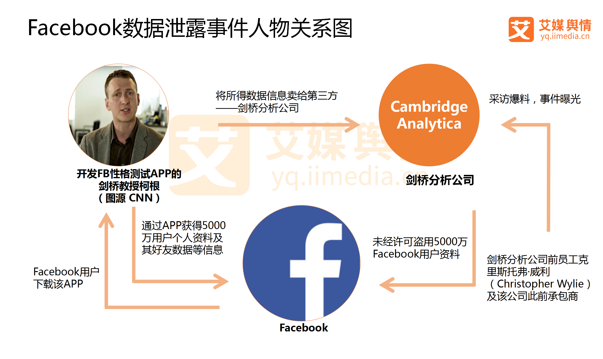
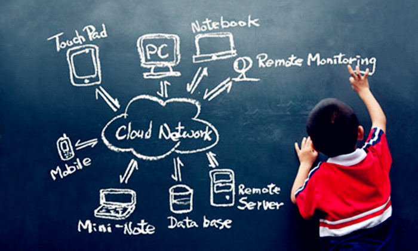

# 互联网时代的热点领域选择、营销方法

_by ShoringN_

### 一、互联网热点领域
#### 1、无人驾驶

曾有人阐述无人驾驶要分三步走，即从人为驾驶过渡到智能驾驶，再从智能驾驶过渡到无人驾驶，这个过程的本质就是**AI来代替人类做一些事、做一些选择、做一些决定**，以达到个人的解放；而智能驾驶正在做的就是通过技术手段解决传统驾驶方式产生的用户痛点。例如根据环境调整行驶速度、精确选取行驶路线、以缓解交通拥堵等，是“**AI辅助人类**”的角色定位，它在2018年有了更充分的发展。

随着5G时代的来临，AI技术的进一步成熟，无人驾驶则在2018年受到了业界内外的广泛关注。然而，3月24日于亚利桑那州凤凰城发生的一起**无人驾驶事故**，给无人驾驶的趋势蒙上了一层阴影。5月23日，Uber官宣关闭亚利桑那州自动驾驶汽车业务。这起事故的发生让原本就对AI认识不足的人群，在媒体的大肆造势后而陷入反AI的舆论和情绪当中，更是引发了一番关于 **“AI与人类之争”的大讨论** 。科技的进步总不是一帆风顺的，看来我们距离真正的无人驾驶还有很长的路要走。

#### 2、人工智能标准化
近些年来，人工智能的广泛发展一方面使我们的社会生产力得到了进一步提高，但是相对而来的也产生了许多浑水摸鱼的“伪人工智能泡沫”。在此背景下，2018年1月，我国发布了《人工智能标准化白皮书2018》，针对我国的**人工智能行业进行了标准规范**，并对行业发展做出指导。

该报告详细梳理了人工智能技术、应用和产业的应用发展情况，分析了人工智能的技术热点、行业动态和未来趋势，从支撑人工智能产业整体发展的角度出发，研究制定了能够适应和引导人工智能产业发展的标准体系，进而提出近期急需研制的基础和关键标准项目，呼吁社会各界共同加强人工智能领域的技术研究、产业投入、标准建设与服务应用，共同推动人工智能及其产业发展。

#### 3、数据伦理

2018年3月，据《纽约时报》报道，剑桥分析（_Cambridge Analytica_）在2016年美国总统大选期间在未经允许的情况下从5000万Facebook用户那里收集数据并将它们用到政治广告中。爆料人正是曾协助创立剑桥分析公司的韦利（_Christopher Wylie_）。与此同时，剑桥分析创始人尼克斯则在官方质询会上表示，公司从未使用过Facebook信息。这一否认无疑将泄密的责任直接推给了Facebook，随后Facebook便陷入泄密门的漩涡之中，**用户隐私保护遭到质疑**。
 
先是获得用户信息，然后再此基础上进行数据分析，再根据分析结果利用用户的喜好渗透进入社交网络，从而进一步改变用户的行为模式，形成了一个完整的闭环。这原本是市场营销策略中常见的套路，却因为**数据的泄露和政治上的应用**引发了民众关于“数据伦理”的深度思考。如何**完善数据开放机制**，又如何**进行数据治理**，成为了如今我们更应该思考的关键问题。

#### 4、教育普及化

2017年7月，人工智能首次上升到国家战略层面，国务院发布了《新一代人工智能发展规划》。3个月后，人工智能写进十九大政府工作报告。之后政府开始密集的出台了一系列人工智能相关政策。《新一代人工智能发展规划》明确表示，**中小学应该设置人工智能相关课程**，推广编程教育，并要尽快在试点的高校设立人工智能学院、增设人工智能相关学科方向硕士、博士招生名额。在政策的推动下，全国掀起了一场“**人工智能教学运动**”。
 
中等教育方面，2018年1月，教育部公布的《普通高中课程方案和语文学科课程标准（2017年版）》中，正式将人工智能、物联网、大数据处理划入新课标，并把 **“数据与计算”，“信息系统与社会”两个模块设立为必修课程**，该标准将于今年秋季学期开始执行。一本名为《人工智能基础（高中版）》的教科书于4月底正式发布，由商汤科技、华东师范大学慕课中心以及上海交大附中、华师大附中等 6 个学校的老师合作完成。
 
高等教育方面，大学人工智能和机器学习相关课程注册率在全球范围都有大幅提升，最引人注目的是清华大学相关课程的增长率，2017年的注册率比2010年高出16倍，比2016年高出了将近3倍。

### 二、互联网时代营销方法
**大数据时代**的到来对人类的影响是深刻的。它不仅改变了传播方式、颠覆了传统的媒体使用习惯,甚至改变了人类认识世界的规律。在大数据时代,**营销架构在数据的基础之上**,企业把对**数据的挖掘、处理和分析能力**转化为商业价值。大数据改变了人们的生活,从思维方式、营销理念和营销方法上进行全方位的变革,大数据营销将成为未来的营销发展趋势。
